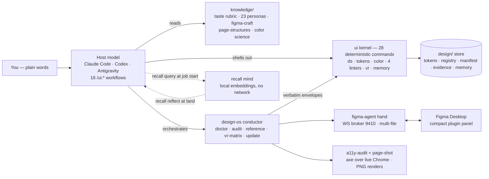
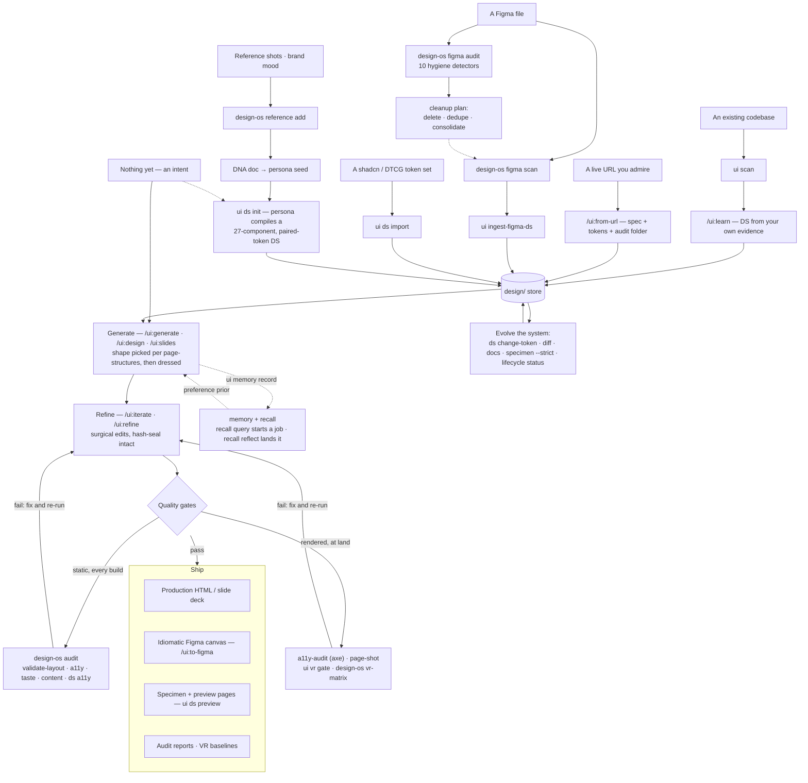

<h1 align="center">DESIGN:OS</h1>

<p align="center"><b>Describe what you want in plain words — get production-grade, on-system UI back.</b></p>

<p align="center">
  [<a href="#quick-start">Quick start</a>] ·
  [<a href="#built-by-the-studio-behind-designos">Gallery</a>] ·
  [<a href="#workflow-map--every-way-in-every-way-out">Workflow map</a>] ·
  [<a href="#the-machine-floor">The machine floor</a>] ·
  [<a href="#the-figma-hand">The Figma hand</a>] ·
  [<a href="#the-surfaces">Surfaces</a>]
</p>

<p align="center"><sub>
<code>v0.1.0</code> · Node ≥ 20 · MIT · zero-dependency <code>ui</code> kernel ·
1,787 tests green · 23 personas · a 27-component kit · four deterministic linters
</sub></p>

DESIGN:OS is a multi-runtime **design CLI**. You drive it through the agent CLI you
already use (Claude Code, Codex CLI, or Antigravity) with plain-language `/ui:*` commands.
The host model writes the HTML; DESIGN:OS supplies the taste — personas, a compiled
design system, and a hard quality gate the model cannot talk past. **No API keys, no
design tokens to hand-edit, no taste vocabulary to learn.**

---

## Built by the studio behind DESIGN:OS

Five live products, five different worlds — an AI dev-tool, a farm's direct-to-Hanoi
fruit brand, a plugin marketplace, a villa-care service, a deal CRM for real-estate
brokers. Same studio, same design discipline this toolchain distills. **Real scrolling
recordings of the live sites — every demo links through.**

<table>
  <tr>
    <td width="50%"><a href="https://easeui.design/"></a></td>
    <td width="50%"><a href="https://www.traicaybentre.com/"></a></td>
  </tr>
  <tr>
    <td><b>EaseUI</b> · <a href="https://easeui.design/">easeui.design</a><br/><sub>AI UI generation · SaaS landing</sub></td>
    <td><b>Trái Cây Bến Tre</b> · <a href="https://www.traicaybentre.com/">traicaybentre.com</a><br/><sub>D2C farm brand · editorial e-commerce</sub></td>
  </tr>
  <tr>
    <td><a href="https://www.gravityhive.com/"></a></td>
    <td><a href="https://www.hvs.care/"></a></td>
  </tr>
  <tr>
    <td><b>GravityHive</b> · <a href="https://www.gravityhive.com/">gravityhive.com</a><br/><sub>plugin marketplace · brutalist type</sub></td>
    <td><b>HVS</b> · <a href="https://www.hvs.care/">hvs.care</a><br/><sub>villa & homestay care · bilingual services</sub></td>
  </tr>
  <tr>
    <td colspan="2" align="center"><a href="https://www.sodeal.vn/"></a></td>
  </tr>
  <tr>
    <td colspan="2" align="center"><b>SổDeal</b> · <a href="https://www.sodeal.vn/">sodeal.vn</a><br/><sub>deal CRM for real-estate brokers · SaaS</sub></td>
  </tr>
</table>

Under the hood the same mechanism scales from one screen to a whole product: 23 personas
compile the same 27-component, paired-token kit into any system (`ui ds init`), and every
generated surface passes the same machine gates before it ships. The toolchain is also
dogfooded on a production internal developer platform — a 129-component Figma library
scanned, hygiene-audited, contrast-proven, and VR-baselined end to end.

---

## Six verbs

The whole tool fits in six moves. Everything else is depth on demand.

| Verb | What it does |
| --- | --- |
| `/ui:generate <intent>` | Fresh design from plain words. Personas picked, DS compiled, variants scored through the gate before you see them. |
| `/ui:learn` | Brownfield onboarding — compile the DS from **your project's own evidence** (code, a URL, or Figma) instead of a persona default. |
| `/ui:iterate` · `/ui:refine` | Tweak in plain words; surgical line-diffs, re-scored; the DS hash-seal stays intact. |
| `/ui:from-url <url>` | Extract a live site's design system into a portable folder (spec + tokens + audit). |
| `/ui:to-figma <intent>` | Author **idiomatic Figma** on the canvas — auto-layout, real instances, token-bound variables. |
| `/ui:why <question>` | Ask *why* a past design decision was made — answers with provenance from the project's design memory. |

<details>
<summary><b>All 16 workflows</b> (audit · critique · design · evidence · extract · figma · from-ref · slides · redesign …)</summary>

| Command | What it does |
|---|---|
| `/ui:generate <intent>` | Start a fresh design from a plain-language description. Token-bound variants across diverse personas. |
| `/ui:iterate <change>`  | Tweak the current design in plain words; applied as a surgical line-diff, re-scored by the gate. |
| `/ui:refine`            | Run the full critique→refine polish loop on the current design. |
| `/ui:redesign <intent>` | Reimagine an existing page in a different persona/direction. |
| `/ui:from-url <url>`    | Extract a live site's design system into a self-contained `./<slug>/` folder (spec + tokens + audit). |
| `/ui:from-ref <path>`   | Generate from a reference (image/markup), matching its look on your design system. |
| `/ui:figma`             | Reproduce a Figma source 1:1 as HTML (keeps source colors intentionally). |
| `/ui:to-figma <intent>` | Author idiomatic Figma on the canvas from intent — needs the figma-agent hand. |
| `/ui:extract`           | Pull a design system **out of** existing HTML. |
| `/ui:slides <intent>`   | Generate a token-bound slide deck. |
| `/ui:learn`             | Compile the DS from the project's own evidence (code, URL, or Figma). |
| `/ui:design <brief>`    | The AI-designer flow — scope-aware facet planning + curator scoring on a full brief. |
| `/ui:audit <target>`    | Run the deterministic audit families against a produced design. |
| `/ui:evidence`          | Intake user evidence (interviews, tickets, analytics) into the anti-fabrication ledger. |
| `/ui:why <question>`    | Trace picks, edits, verdicts, and token changes from the design memory, with provenance. |
| *(internal)* `/ui:critique` | The gate — runs inside every HTML-emitting flow. |

</details>

---

## Quick start

```sh
git clone https://github.com/jangtrinh/design-os.git
cd design-os && npm install && npm run build && npm link
ui doctor                      # verify the install is healthy
```

Wire it into the project you want to design for:

```sh
cd ~/code/your-app
ui init --runtime claude       # or: --runtime codex | --runtime antigravity
```

Then open your agent CLI in that project and type:

```
/ui:generate a pricing page for a developer-tools SaaS — 3 tiers, dark theme
```

That's the whole loop: **describe → pick → refine.** Have an existing app? Run
`/ui:learn` first so the DS is compiled from your product's own evidence.

> Once published to npm, a global install replaces the clone-and-link step.

---

## The machine floor

Most design guidance is prose the model can talk itself past. The DESIGN:OS floor is
**code**: four deterministic linters run on every build, and the rendered tier re-checks
what static analysis can't see. A rule breach *cannot* pass — the gate is enforced, not
suggested.

| Layer | What it proves |
|---|---|
| `ui taste-lint` — 14 absolute checks | The generated-UI tells: `transition: all`, layout-property keyframes, missing reduced-motion, overshoot easing, italic display headings, uppercase line-height < 1, focus rings that fade in, z-index inflation, off-grid spacing, mixed icon sets… |
| `ui validate-layout` — 12 checks | Structural + overflow safety: unclosed tags, fixed-width overflow, `100vw` traps, root `overflow-x: hidden` breaking sticky. |
| `ui content-lint` — 10 checks | Honest copy: lorem-ipsum, placeholder copy, placeholder names (Jane Doe / Acme), click-here links, all-caps shouting. |
| `ui a11y-lint` + `ui ds a11y` | Tier-1 static WCAG checks + **token-pair contrast** (every `{role}/{role}-foreground` pair ≥ AA, hover/active states included). Never claims "compliant" — says exactly what it checked. |
| `a11y-audit` + `page-shot` + `ui vr` | The rendered tier: axe-core over live Chrome, deterministic PNG renders, pixel-level visual-regression gates per component (`design-os vr-matrix`). |

The pairing is structural: **every standard ships an emitter and a linter in the same
commit** — prose-only rules drift; enforced rules hold.

---

## Workflow map — every way in, every way out

### The surfaces at a glance



### The journeys — six ways in, one store, two gate tiers, four ways out



Every path composes with every other: a team can enter at **E4** (audit + clean a messy
Figma library), exit with a specimen page, re-enter at **E2** on the app repo, and land
both through the same gates — the store is the meeting point, the gates are the contract.

---

## The Figma hand

<table>
  <tr>
    <td></td>
    <td></td>
    <td>
      <b>figma-agent</b> drives a Figma plugin over a local self-healing broker:
      reconnect back-off, heartbeats, a park queue that holds commands through a broker
      respawn, and a <b>multi-file registry</b> — several open files stay connected at
      once, commands route to the most-recently-active one (pin with
      <code>FIGMA_AGENT_FILE</code>). The panel opens compact (300×170) and stays out of
      your way.
    </td>
  </tr>
</table>

Three moves, both directions:

- **Read** — `design-os figma scan` exports components/variables/styles;
  `ui ingest-figma-ds` turns them into tokens + registry + DESIGN.md.
- **Audit** — `design-os figma audit` runs ten deterministic DS-hygiene detectors over
  the open file's component library (unused · junk names · deprecated · duplicates by
  name and by structure · dead variants · redundant families · empty sets · misfiled · unbound paints) —
  a raw one-pass scan that survives 160k-instance files, judged entirely in
  fixture-tested CLI code.
- **Write** — `/ui:to-figma` authors idiomatic canvas: auto-layout, real instances,
  token-bound variables, drift-asserted geometry.

Kept deliberately *out* of the `ui` binary (it needs a network and a live plugin); ships
in-repo as the `figma-agent/` workspace. Fall back to `/ui:generate` (HTML) any time the
hand is unavailable.

### Why a CLI hand, not (just) the Figma MCP

The official Figma MCP is built to pull a design **into the conversation**; the hand is
built to operate **on the file**. That difference is architectural, not cosmetic:

- **Results are files, not context.** Every MCP tool result must pass through the model's
  context window — a whole-file scan or a 160k-instance usage census doesn't fit, and what
  does fit costs tokens again on every retry. The hand writes JSON to disk (`--out`); the
  model reads the summary and queries the rest.
- **Deterministic and scriptable.** One command → one JSON envelope → stable exit codes.
  Pipe it to `jq`, gate CI on it, run it from cron, replay a captured scan offline. An MCP
  call exists only inside a live model session.
- **Engineered for heavy files.** Chunked transport, a park queue that holds commands
  across broker respawns, warm retry, per-page representative resolution — the DS scan and
  the hygiene audit finish on files that kill a single long round-trip.
- **Multi-file and pinnable.** Several open files stay registered at once;
  `FIGMA_AGENT_FILE` pins the target so a scan can't silently hit the wrong file.
- **No seat, no OAuth, no rate limits.** A development plugin on Figma Free plus a local
  broker.

**When the Figma MCP is the right tool** — and we use it too: implementing a *selected
frame* as code (`get_design_context` + Code Connect are built exactly for that), quick
one-off reads (screenshot a node, list variables) with zero setup, and the richer
paid-seat read surface. Rule of thumb: **MCP to bring a design to the model; the hand to
bring changes, audits, and evidence to the file.**

---

## The surfaces

| Surface | Path | What it is | Tests |
|---|---|---|---|
| **`ui` kernel** | `src/` | 28 deterministic commands — DS compile/mutate/preview, tokens, OKLCH color math, the four linters, VR, memory, evidence. Zero runtime dependencies, no network, no model calls. | 1,525 |
| **`design-os` conductor** | `design-os/` | Python/Typer umbrella that composes everything: `doctor` · `audit` · `reference` · `vr-matrix` · `figma status/scan/audit` · `update` (one-command toolchain refresh on any machine) · entry-point plugins. Re-emits every underlying envelope **verbatim** — one source of truth per verdict. | 101 |
| **`figma-agent` hand** | `figma-agent/` | CLI + WS broker + Figma plugin: canvas authoring, DS scan, the 9-detector hygiene audit, exec-js, capture. | 161 |
| **rendered-tier hands** | `a11y/` | `a11y-audit` (axe-core over installed Chrome — wording never claims "compliant") + `page-shot` (deterministic full-page PNG). | — |
| **`recall` mind** | `recall/` | Optional semantic memory: local embeddings (MiniLM/ONNX, nothing leaves the machine), hybrid RRF ranking, `query → …work… → reflect` loop. The kernel never imports it — a test fails the build if it does. | — |
| **`knowledge/` core** | `knowledge/` | The model-facing brain: 6+1-axis taste rubric, 23 personas / 7 families, page-structures (21 shapes + diversification + honest copy), two-tier a11y model, color science, token taxonomy, `figma-craft/` construction tree. | — |

<details>
<summary><b>All 28 <code>ui</code> commands</b></summary>

| Command | Summary |
|---|---|
| `ui guide` | Plain-language map of the `/ui:*` workflow (**start here**) |
| `ui schema` | Machine-readable signatures for every (sub)command |
| `ui doctor` | Verify an install (and, with `--cwd`, a project) is healthy |
| `ui scan` | Detect existing design signals — routes brownfield projects to `/ui:learn` |
| `ui init` | Write the manifest + per-runtime adapter tree |
| `ui ds` | Compile/inspect/mutate the DS (`init`/`import`/`context`/`change-token`/`status`/`diff`/`docs`/`a11y`/`specimen`/`preview [--split]`) — `init` compiles the 27-component paired-token kit |
| `ui tokens` | Compile a DTCG token file to CSS / Tailwind / Figma variables |
| `ui color` | OKLCH color math: convert, scale, contrast, semantic palette |
| `ui taste-lint` | 14 absolute taste checks across 6 axes |
| `ui validate-layout` | 12 structural/overflow checks |
| `ui content-lint` | 10 honest-copy checks |
| `ui a11y-lint` | Tier-1 static WCAG checks (not a conformance claim) |
| `ui audit` | Deterministic DS-violation audit of a structured node export (5 families) |
| `ui critique-coverage` | Acceptance-criteria coverage of a produced design |
| `ui flow` | Lint a multi-screen flow's IA graph |
| `ui vr` | Visual-regression diff/gate (zero-dep PNG codec + pixelmatch) |
| `ui evidence` | User-evidence ledger with an anti-fabrication gate |
| `ui memory` | Design-decision ledger → compiled graph → cross-project taste profile |
| `ui changelog` | Fold DS history into a readable changelog |
| `ui ingest-figma-ds` | Onboard a scanned Figma DS (ds.json → tokens + registry + DESIGN.md) |
| `ui synthesize-conventions` | Learn applied conventions from real screens |
| `ui designmd` | Extract tokens, snapshot, audit DESIGN.md folders |
| `ui registry` | Component registry store: register, lookup, list |
| `ui edit-strategy` | Select edit strategy, number lines, apply ln-diff patch |
| `ui autofix` | 5 deterministic HTML fix rules |
| `ui export` | Export HTML as a standalone self-contained file |
| `ui strip-fences` | Remove fences + stray prose around LLM HTML |
| `ui parse-json-stream` | Extract concatenated JSON objects from a stream |

</details>

---

## How the loop works, mechanically

1. **You describe intent** → `/ui:generate landing page for a new gym`.
2. **Personas + DS compile** — the model scores intent against 23 personas, picks a
   diverse top-K; `ui ds init` compiles semantic paired tokens + the component registry +
   a hash-sealed manifest, emitting a Tailwind `@theme` the HTML consumes as utilities.
3. **Variants come back** — each from a different persona; the critique gate scores them
   *before* you see them; failures regenerate. The page **shape** is picked first
   (`knowledge/page-structures.md` — 21 macrostructures, honest copy, no invented
   metrics), the dress second.
4. **You refine in plain words** — edits apply surgically; the gate re-scores; the DS
   hash-seal keeps refinements on-system.
5. **Memory compounds** — decisions land in the ledger; `recall query` primes the next
   job; `recall reflect` distills the lesson at the end. Neither ever calls a model.

---

## Status & honest boundaries

**Dogfooded on real work, not fixtures:** a production Figma project (129-component
library scanned, audited, reconciled), a full brand pipeline (reference intake → DNA →
compiled brand DS → the plugin panel you see above, contrast machine-corrected), and the
toolchain's own preview/specimen surfaces.

Still open, stated plainly:

- **`figma-agent audit-ds` live acceptance** — unit-tested + fixture-proven; the
  ground-truth comparison against a hand-classified 129-component audit runs on the next
  plugin reload.
- **`/ui:to-figma` canvas E2E** — live-validated piecewise; a full intent→canvas run on a
  fresh file is still scheduled.
- **Taste-rubric threshold calibration** — the ≥7 per-axis cutoff is a reasoned default;
  tuning against a labeled corpus is future work. The deterministic floor already removes
  the worst failure mode.

---

## Contributing

Four gates stay green (`typecheck` · `lint` · `build` · `test`), the `ui` kernel stays
zero-runtime-dependency and deterministic, and **every new standard ships its emitter and
its linter in the same commit**. See [CONTRIBUTING.md](CONTRIBUTING.md) and
[CHANGELOG.md](CHANGELOG.md).

## License

MIT — see [LICENSE](LICENSE). The gate is the product; the taste is yours.
