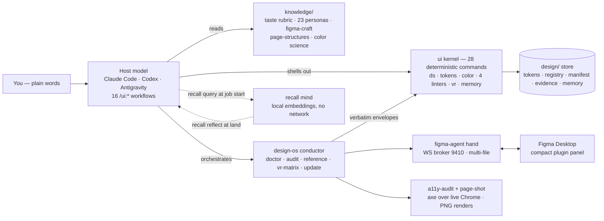

# ease-design

**Describe what you want in plain words — get production-grade, on-system UI back.**

ease-design is a multi-runtime **design CLI**. You drive it through the agent CLI you
already use (Claude Code, Codex CLI, or Antigravity CLI) with plain-language `/ui:*`
commands. The host model writes the HTML; ease-design supplies the taste — personas, a
compiled design system, and a hard quality gate — so the output looks like a pro
designer made it. **No API keys, no design tokens to hand-edit, no taste vocabulary to learn.**

<sub>`v0.1.0` · Node ≥ 20 · MIT · zero runtime dependencies in the `ui` kernel ·
1,787 tests green across three surfaces (`ui` 1,525 · `figma-agent` 161 · `design-os` 101)</sub>

> Distilled from EaseUI's design engine. The binary and slash-command namespace are
> `ui` / `/ui:*`.

---

## Who it's for

One engine, two audiences:

- **Designers** — turn intent into polished, on-system UI without writing HTML/CSS. You
  work entirely through plain-language `/ui:*` commands: describe it, get production HTML
  out, quality enforced by a taste gate you never have to babysit.
- **Developers** — the same `/ui:*` commands, **plus** a deterministic `ui` binary you can
  script directly: token-bound output, a component registry, and a machine-checked quality
  floor. Not a black box.

Both talk to the same two sources of truth, so a designer's output and a developer's output
obey the identical design system.

## Requirements

- **Node.js ≥ 20**
- **An agent CLI** — [Claude Code](https://claude.ai/code), Codex CLI, or Antigravity.
  This *is* the interface: ease-design is CLI-native by design. There is no separate GUI.

---

## Install

```sh
git clone https://github.com/jangtrinh/ease-design.git
cd ease-design
npm install
npm run build
npm link          # exposes the `ui` binary on your PATH
```

Verify the install is healthy:

```sh
ui doctor
```

`ui doctor` checks Node ≥ 20 and that the bundled `knowledge/`, `schemas/`, and
`templates/` all resolve with their key files — so you catch a broken setup immediately
instead of mid-design.

> Once published to npm, `npx ease-design` (or a global install) replaces the
> clone-and-link step.

---

## Quick start

### 1. Wire ease-design into your project

From the root of the project you want to design for:

```sh
ui init --runtime claude       # or: --runtime codex | --runtime antigravity
ui doctor --cwd .              # confirm the project wired up correctly
```

`ui init` writes a per-runtime adapter tree. For **Claude Code** that is
**12 `/ui:*` workflow commands** (`.claude/commands/ui/`) + **8 supporting skills**
(`.claude/skills/ease-design-*/`). Codex gets an `AGENTS.md` block; Antigravity gets the
equivalent workflow tree. Every generated wrapper anchors the absolute `knowledge/` path,
so the workflows resolve no matter where the project lives.

### Have an existing app?

If the project already has UI, don't jump straight to `/ui:generate` — run `/ui:learn`
right after `ui init`. It scans the repo, asks one question (learn from code, a URL,
Figma, or start fresh), and compiles a design system from **your product's own
evidence** instead of a persona default. The flow becomes **init → `/ui:learn` →
`/ui:generate`** — so the output actually matches what you already shipped.

### 2. Design, entirely in plain words

Open your agent CLI in the project and type a `/ui:*` command:

```
/ui:generate a pricing page for a developer-tools SaaS — 3 tiers, dark theme
```

ease-design picks personas, compiles a project-scoped design system (semantic tokens →
Tailwind `@theme`), generates variants, and scores each through the critique gate before
you see it. Failing variants regenerate automatically. **You pick the winner by eye.**

### 3. Refine, still in plain words

```
/ui:iterate make the middle tier the visual hero; warm up the accent
/ui:refine
```

`iterate` translates your request into token/layout edits and applies them surgically;
`refine` runs the full critique→refine polish loop. The design-system hash-seal stays
intact throughout, so refinements can't silently drift off-system.

That's the whole loop: **describe → pick → refine.** No keys, no config, no CSS.

---

## The `/ui:*` workflows

These surface as slash-commands in your agent CLI (Claude Code namespace shown).

| Command | What it does |
|---|---|
| `/ui:generate <intent>` | Start a fresh design from a plain-language description. Produces token-bound variants across diverse personas. |
| `/ui:iterate <change>`  | Tweak the current design in plain words; applied as a surgical line-diff, re-scored by the gate. |
| `/ui:refine`            | Run the full critique→refine polish loop on the current design. |
| `/ui:redesign <intent>` | Reimagine an existing page in a different persona/direction. |
| `/ui:from-url <url>`    | Extract a **live site's** design system into a self-contained `./<slug>/` folder (spec + tokens + audit). |
| `/ui:from-ref <path>`   | Generate from a reference (image/markup), matching its look on your design system. |
| `/ui:figma`             | Reproduce a Figma source 1:1 as HTML (keeps source colors intentionally). |
| `/ui:to-figma <intent>` | The inverse: **author idiomatic Figma** on the canvas (Figma Free) from intent — auto-layout, instances, token-bound variables. Needs the external figma-agent hand (see below). |
| `/ui:extract`           | Inverse direction — pull a design system **out of** existing HTML. |
| `/ui:slides <intent>`   | Generate a token-bound slide deck. |
| `/ui:learn`             | Brownfield onboarding — compile the DS from the project's own evidence (code, URL, or Figma) instead of a persona default. |
| `/ui:design <brief>`    | The AI-designer flow — scope-aware facet planning + curator scoring on a full brief. |
| `/ui:audit <target>`    | Run the deterministic audit families against a produced design. |
| `/ui:evidence`          | Intake user evidence (interviews, tickets, analytics) into the anti-fabrication ledger that grounds design decisions. |
| `/ui:why <question>`    | Answer *why* a past design decision was made — traces picks, edits, verdicts, and token changes from the project's design memory, with provenance. |

*(16 workflows total; `/ui:critique` runs inside every HTML-emitting flow as the gate.)*

All HTML-emitting workflows defer to an internal **critique gate** (12th workflow): the
model scores 6 craft axes + 1 consistency axis, and a deterministic `ui taste-lint` floor
enforces the machine-checkable rules underneath — so an axis with a real rule breach
*cannot* pass. Quality is enforced, not merely suggested.

### The Figma authoring track (`/ui:to-figma`)

`/ui:to-figma` gives ease-design a second output medium: **real, idiomatic Figma** on the
canvas (Figma Free), not just HTML. It reuses the same design brain — personas, tokens, and
the critique gate — plus a Figma **construction knowledge** core (`knowledge/figma-craft/`):
auto-layout / sizing mastery, components + variables over hardcoded values, and 14
construction lints that keep the layer structure senior-grade.

The **hands** are the `figma-agent` CLI, which drives a Figma plugin over a local
self-healing broker (ports 9410–9419: reconnect back-off, heartbeats, a park queue that
holds commands through a broker respawn, and a **multi-file registry** — several open Figma
files stay connected at once; commands route to the most-recently-active file, pinnable via
`FIGMA_AGENT_FILE`). The plugin panel is compact (300×170), brand-styled, and expands on
demand. In keeping with ease-design's deterministic-binary principle the hand is deliberately
kept *out* of the `ui` binary (it needs the network and a live plugin) and is not published
with the `ease-design` npm package — but it ships **in-repo** as an npm workspace at
`figma-agent/`. Build it once from the repo root with
`npm run build --workspace=figma-agent`, then follow `knowledge/figma-agent-hand.md` to load
the plugin. Fall back to `/ui:generate` (HTML) if the hand is unavailable.

Beyond authoring, the hand also **reads and audits**: `figma-agent scan-design-system`
exports the open file's components/variables/styles for `ui ingest-figma-ds`, and
`figma-agent audit-ds` runs an automated **DS-hygiene audit** of the component library —
nine deterministic detectors (unused, junk names, deprecated, duplicates by name and by
structure, redundant families, empty sets, misfiled, unbound-paint token violations) over
a raw one-pass scan that survives 160k-instance files.

### `/ui:from-url` output

`/ui:from-url <url>` writes a portable folder under `./<slug>/`:

```
<slug>/
├── DESIGN.md              # the extracted design spec
├── DESIGN.preview.html    # rendered preview
├── source.html/.css       # raw audit trail
├── tokens.json            # frequency-ranked source tokens with provenance
├── run-summary.md
└── audit.md               # exit code GATES the workflow (5 audit families)
```

Flags: `--name <slug>`, `--out-dir <path>`, `--force`.

---

## The `ui` binary (for developers & scripting)

Every non-LLM task is a deterministic `ui` subcommand — pure transforms, no network, no
model calls, same bytes for the same input. Run `ui guide` for the plain-language map, or
`ui <command> --help` for details. Add `--json` to any command for a machine-readable
envelope.

| Command | Summary |
|---|---|
| `ui guide` | Plain-language map of the `/ui:*` workflow (**start here if you're new**) |
| `ui schema` | Machine-readable signatures for every (sub)command — flags, enums, error codes |
| `ui doctor` | Verify an ease-design install (and, with `--cwd`, a project) is healthy |
| `ui scan` | Detect existing design signals — routes brownfield projects to /ui:learn |
| `ui init` | Write the ease-design manifest and per-runtime adapter tree |
| `ui ds` | Compile, inspect, and mutate the project's design system (`init`/`import`/`context`/`change-token`/`status`/`diff`/`docs`/`a11y`/`specimen`/`preview`). `init` compiles the 27-component paired-token kit; `import` onboards an existing flat tokens.json; `specimen --strict` gates completeness; `preview [--split]` renders the machine-generated specimen page(s). |
| `ui memory` | Per-project design-decision ledger → compiled graph → cross-project taste profile (`record`/`compile`/`context`/`query`/`consolidate`/`fingerprint`/`status`/`export-corpus`) |
| `ui changelog` | Fold the design-system history (manifest changelog + recorded decisions) into a readable changelog |
| `ui tokens` | Compile a DTCG token file to CSS / Tailwind / Figma variables |
| `ui color` | OKLCH color math: convert, scale, contrast, semantic palette |
| `ui taste-lint` | Deterministic taste-rubric floor for generated HTML — 14 absolute checks across 6 axes (incl. the hallmark-derived slop gates) |
| `ui audit` | Deterministic DS-violation audit of a structured node export (5 families) |
| `ui critique-coverage` | Deterministic acceptance-criteria coverage of a produced design (the curator's goal axis) |
| `ui ingest-figma-ds` | Onboard an existing Figma design system (`figma-agent scan-design-system` output → tokens + registry + DESIGN.md) |
| `ui synthesize-conventions` | Learn applied conventions from real screens (usage-dna.json → CONVENTIONS.md) |
| `ui flow` | Lint a multi-screen flow's IA graph — unreachable screens, dead ends, missing error/empty states, dangling refs (`flow lint`) |
| `ui a11y-lint` | Static-HTML accessibility linter — Tier-1 WCAG checks (alt, lang, title, tabindex, zoom, unnamed icon/emoji controls, heading order). Not a conformance claim. |
| `ui evidence` | User-evidence ledger with an anti-fabrication gate — a quote finding must be a verbatim substring of its committed source (the binary can't invent user words). Feeds `critique-coverage --evidence-dir`. (`add`/`list`/`verify`/`show`) |
| `ui vr` | Deterministic visual-regression — diff two screenshots or gate a baseline dir against fresh renders (zero-dep PNG codec + pixelmatch, anti-aliasing detection, masks). The binary compares; the host renders. (`diff`/`gate`/`accept`) |
| `ui content-lint` | Deterministic content / UX-writing floor — low-FP static checks (lorem-ipsum, placeholder copy, click-here links, bare error codes, `item(s)`, insensitive terms, text-in-image, all-caps). Voice/tone fit stays a model judgment. |
| `ui validate-layout` | Static HTML structural/overflow linter (12 heuristic checks, incl. 100vw-width and root `overflow-x: hidden`) |
| `ui autofix` | Apply 5 deterministic HTML fix rules (viewport, imgs, Lucide, CDN, dup-ids) |
| `ui registry` | Component registry store: register, lookup, list |
| `ui edit-strategy` | Select edit strategy, number HTML lines, apply ln-diff patch |
| `ui designmd` | Extract tokens, snapshot, and audit `DESIGN.md` folders |
| `ui export` | Export HTML as a standalone self-contained file |
| `ui strip-fences` | Remove fences + stray prose around a full LLM HTML document |
| `ui parse-json-stream` | Extract concatenated JSON objects from a file or stdin |

### Design Memory (`ui memory`)

Every other `ui` command is stateless; **`ui memory`** is where a project's taste history
accrues. It closes the feedback loop the rest of the pipeline was missing: an **append-only
event ledger** (`design/memory.events.jsonl` — what personas got picked, which axis a variant
failed, which vibe edit fixed it, why a token changed) compiles deterministically into a
**graph** (`ui memory compile`) that `/ui:generate` reads back as a *preference prior*, and
consolidates across projects into a **cross-project taste profile** (`~/.ease-design/`). The
precedence is strict — **brief > project memory > taste profile > `knowledge/` floors** — so
memory only *biases* generation; it never overrides the brief and never touches critique
scoring (the gate stays craft-only). It is cold-start-safe: an empty ledger returns
`memory: empty` and callers proceed, with provenance seeded the first time you run `/ui:learn`
or `/ui:generate`.

Two **pure seams** let an optional semantic-recall layer sit on top without ever touching the
binary's zero-dependency, no-network guarantee: `ui memory export-corpus [--since <eventId>]`
emits the ledger as tiered natural-language payloads (`episodic` insights, `semantic` token
rationales + harvest sources, `procedural` persona/vibe signatures) for an external indexer to
embed, and `ui memory context --rank-file <ids.json>` splices a recall-ranked selection back
into the prior. The ledger stays the sole source of truth — any vector index is a rebuildable
view — and a rank file is never spliced into `--for critique`.

### Semantic recall (`recall/`) — optional

Where `figma-agent` is the **hands**, **`recall`** is the **mind**: an optional in-repo workspace
(Node ≥ 22) that makes the design memory searchable *by meaning*. `recall index` embeds the ledger
corpus — and, if you point it at `knowledge/`, the knowledge core too — into a rebuildable
`*.vec.db` (per-project, plus a cross-project index under `~/.ease-design/`). `recall query
"<question>" --out ids.json` then hybrid-ranks it — **RRF over dense KNN + BM25, × the same 30-day
half-life decay the memory graph uses, × bi-temporal validity** so a superseded token rationale is
demoted rather than deleted — and hands the ranked ids straight to `ui memory context --rank-file`.

`recall reflect` closes the loop: it gathers a finished job's events plus what memory already knew,
and prints the exact `ui memory record insight --refs …` write-back. It **never calls a model** —
the host model that just ran the job distils the one durable lesson, so each job's learning
compounds instead of resetting. A design job therefore starts by recalling and ends by reflecting.

Embeddings are **local** (`all-MiniLM-L6-v2`, ONNX); nothing leaves the machine. The `ui` binary
never imports any of it — a test fails the build if `src/` so much as mentions the vector store or
the embedder — so the binary stays zero-dependency, no-network and no-LLM. See
`knowledge/recall-mind.md`.

---

## The `design-os` conductor (Python/Typer umbrella)

Where `ui` is the deterministic kernel and `figma-agent`/`a11y-audit`/`page-shot` are
optional hands, **`design-os`** is the job-level conductor that composes them. It never
reimplements a check — every result is the underlying tool's JSON envelope re-emitted
verbatim, so there is exactly one source of truth per verdict.

| Command | What it does |
|---|---|
| `design-os doctor [--versions]` | One health check across the whole toolchain (`ui`, hands, plugins). |
| `design-os audit <dir>` | Orchestrate the full linter battery (validate-layout · a11y-lint · taste-lint · content-lint · `ui ds a11y`) over generated pages — one summarized verdict. |
| `design-os reference add/list/rm` | Reference intake: capture a live site (pixelshot) into the reference store for DNA extraction and brand seeding. |
| `design-os vr-matrix` | Per-component visual-regression gate over `ui ds preview --split` pages. |
| `design-os figma status/scan/audit` | Drive the Figma hand: connection status (per open file), design-system export, and the automated DS-hygiene audit. |
| `design-os update [--pull] [--check]` | One-command toolchain refresh on any machine (editable install discovers the repo, rebuilds every surface). |
| `design-os plugins` | Entry-point plugin discovery diagnostics (`design_os.plugins`). |

Install once (`uv tool install -e design-os --with-editable design-os/plugins/figma`,
hands via `npm link`), then `design-os update` keeps every machine current from the repo.

---

## Workflow map — every way in, every way out

Two maps: what the surfaces are, and every user journey across them.

### The surfaces



### The journeys — pick your entry, everything converges on the store, ships through the gates


Every path is composable with every other: a team can enter at **E4** (audit + clean a
messy Figma library), exit with a specimen page, re-enter at **E2** on the app repo, and
land both through the same gates — the store is the meeting point, the gates are the
contract.

---

## How it works

ease-design ships two runtime-neutral **sources of truth** and a thin per-runtime adapter:

- **`knowledge/`** — a plain-Markdown knowledge core (taste rubric, persona library,
  generation rules, component catalog, color science, the motion decision ladder, prompt
  modes) the host model reads directly. Never duplicated into code.
- **`ui` binary** — the deterministic Node CLI above for all non-LLM work.
- **Adapters** — `ui init` generates the config a given agent CLI needs to know *when* to
  read the knowledge core and *when* to shell out to `ui`. **The host CLI's own model
  generates the HTML — no API keys to manage.**

The happy path, mechanically:

1. **You describe intent** → `/ui:generate landing page for a new gym`.
2. **ease-design picks personas + compiles a DS.** The model scores your intent against 23
   curated personas and selects a diverse top-K; `ui ds init` compiles project-scoped
   semantic tokens + a component registry + a hash-sealed manifest, and emits a Tailwind
   `@theme` block the HTML consumes as utilities — so "use the design system" is mechanical,
   not retyped hex.
3. **Variants come back**, each from a different persona; the critique gate scores them
   before you see them; failures regenerate.
4. **You refine in plain words**; edits apply surgically; the gate re-scores; the DS
   hash-seal stays intact.

---

## Repo layout

| Path | Purpose |
|---|---|
| `knowledge/` | Markdown knowledge core — taste rubric, personas, page structures, components, color science, token taxonomy, accessibility model, `figma-craft/` construction tree |
| `src/cli.ts` | `ui` binary entrypoint + subcommand router |
| `src/commands/` | one file per `ui` subcommand |
| `src/core/` | shared deterministic logic — color math, tokens, registry, the 4 linters, `component-kit/` (27 components), persona expansion, ds preview |
| `src/adapters/` | per-runtime adapter generation for `ui init` |
| `design-os/` | the Python/Typer conductor (+ `plugins/figma` entry-point plugin) |
| `figma-agent/` | the Figma hand — CLI + WS broker + plugin (npm workspace) |
| `a11y/` | rendered-tier hands — `a11y-audit` (axe) + `page-shot` (npm workspace) |
| `recall/` | optional semantic-recall mind (local embeddings; npm workspace) |
| `schemas/` | JSON Schemas — design tokens, component registry, DS manifest |
| `templates/` | workflow + skill Markdown templates (source of truth for adapter generation) |
| `examples/` | synthetic walkthrough + generation outputs |
| `docs/` | audit-gate report, journals |

---

## Status

**v0.1.0 — deterministic surfaces fully tested; dogfooded on real projects.**

- **`knowledge/` core:** a 6+1-axis taste rubric, 23 personas across 7 families, the
  page-structures shape layer (21 macrostructures + honest-copy + pre-emit self-critique),
  a two-tier accessibility model, color science, token taxonomy, and the `figma-craft/`
  construction tree (canvas ops, component design, curator facets).
- **`ui` kernel:** 28 deterministic commands. `ds init` compiles a **27-component,
  paired-token design system** out of the box (14 contrast-proven pairs across all 23
  personas); `ds specimen --strict` and `ds preview --split` gate and render it.
- **Four deterministic linters** as the machine floor: `taste-lint` (14 checks — incl.
  the hallmark-derived slop gates: overshoot easing, italic display headings, uppercase
  tight line-height, focus rings that fade in, z-index inflation), `validate-layout`
  (12), `content-lint` (10 — incl. placeholder-name), `a11y-lint` (+ `ds a11y` token-pair
  contrast). Rendered tier: axe via `a11y-audit`, pixel gates via `ui vr`.
- **Workflows:** 16 host-model workflows + supporting skills, adapter-generated per
  runtime by `ui init`.
- **The conductor + hands:** `design-os` (Typer umbrella: doctor/audit/reference/
  vr-matrix/figma/update, entry-point plugins), `figma-agent` (self-healing multi-file
  broker, canvas authoring, DS scan + the 9-detector hygiene audit), `a11y-audit` +
  `page-shot`, `recall`.
- **1,787 tests green** across the three suites; the `ui` kernel stays
  zero-runtime-dependency; four CI gates green (typecheck, lint, build, test).
- **Dogfooded on real work, not fixtures:** a production Figma project (129-component
  library scanned, audited, and reconciled), a full brand pipeline (reference intake →
  DNA → compiled brand DS → plugin-panel reskin, contrast machine-corrected), and the
  toolchain's own preview/specimen surfaces.

**Known boundaries (honest):**

- **`figma-agent audit-ds` live acceptance** — unit-tested + fixture-proven; the
  ground-truth comparison against the hand-classified 129-component audit runs on the
  next plugin reload.
- **`/ui:to-figma` canvas E2E** — the authoring pipeline is live-validated piecewise;
  a full intent→canvas run on a fresh file is still owner-scheduled.
- **Taste-rubric threshold calibration** — the ≥7 per-axis pass cutoff is a reasoned
  default; tuning it against a labeled corpus is future work. The deterministic
  `taste-lint` floor already removes the worst failure mode.

---

## Contributing

Four gates must stay green (`typecheck`, `lint`, `build`, `test`) and the `ui` binary stays
zero-runtime-dependency and deterministic. See [CONTRIBUTING.md](CONTRIBUTING.md) and
[CHANGELOG.md](CHANGELOG.md).

## License

MIT — see [LICENSE](LICENSE).
